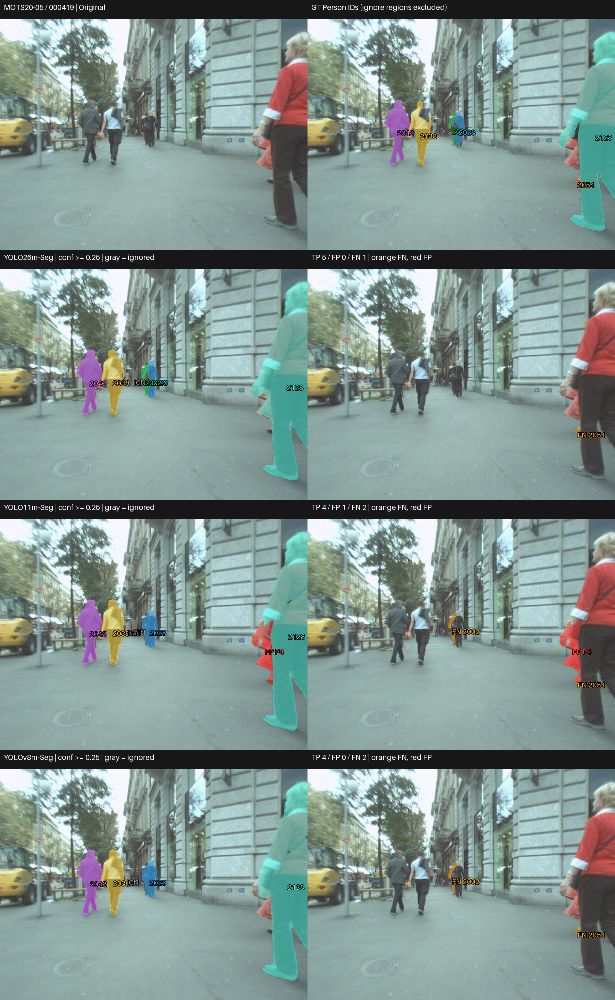
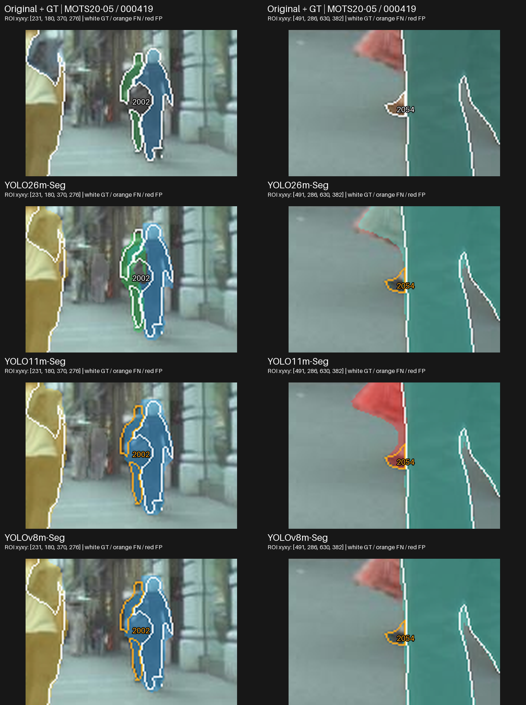
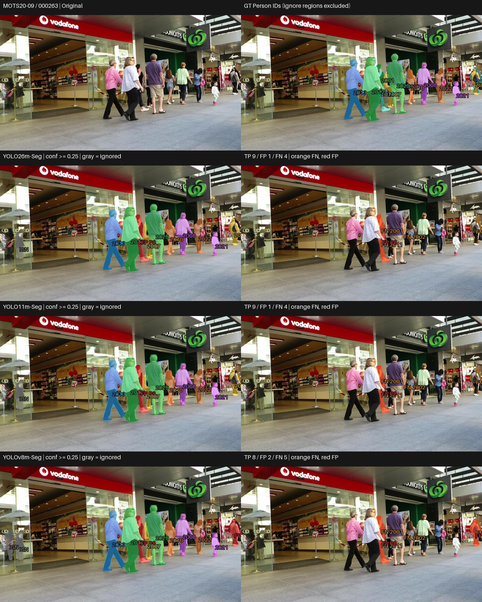
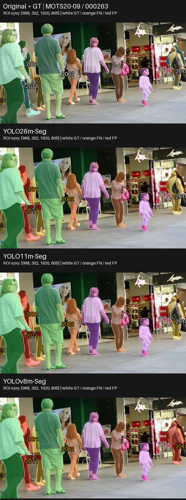
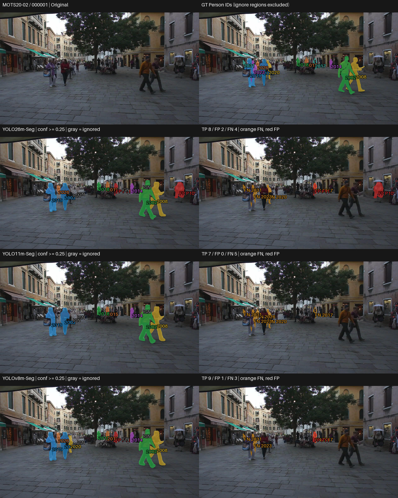
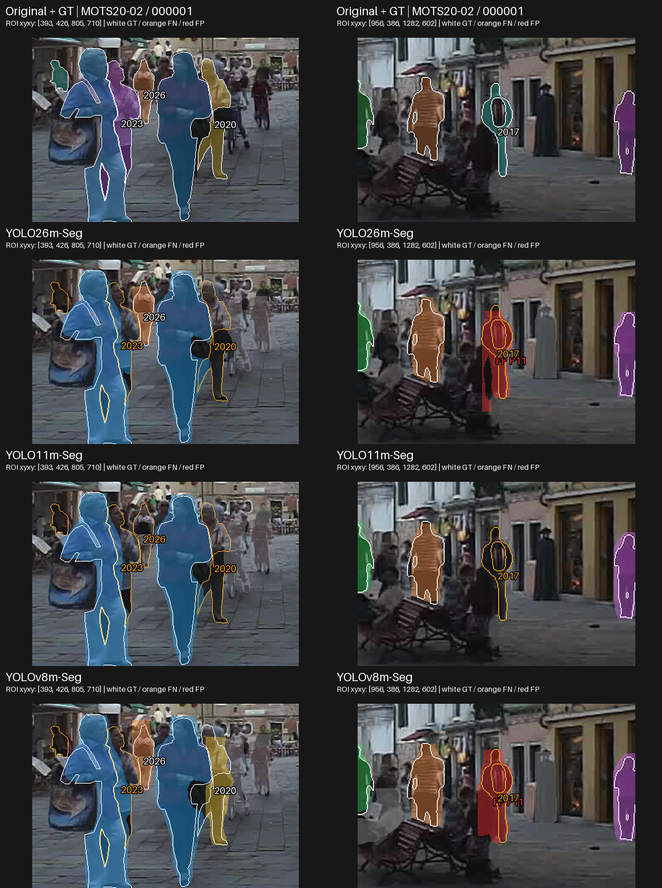
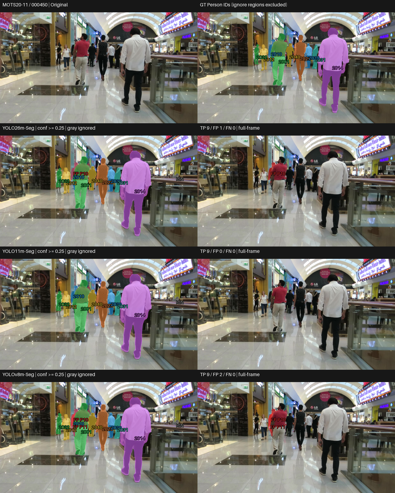
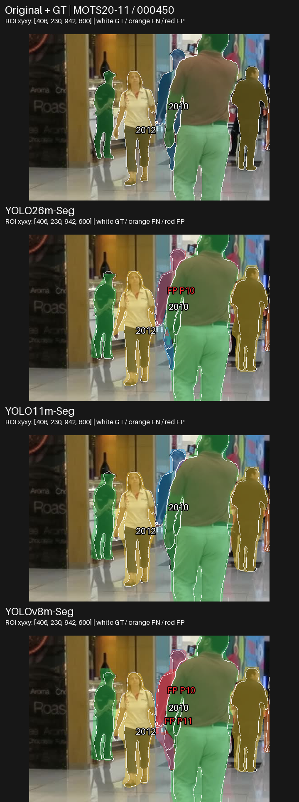

# Medium (M) — Visual and Qualitative Analysis

## 1. ภาพรวมผลการทดลอง

Tier นี้เสร็จครบ 3 โมเดลบน MOTS20 ด้วย pretrained / no fine-tuning; คงสถานะ PASS WITH WARNINGS
เอกสารนี้อ่านพฤติกรรมจาก prediction จริง ส่วนผลเชิงตัวเลขและ trade-off เต็มอยู่ที่ [RESULTS_SUMMARY_TH.md](RESULTS_SUMMARY_TH.md)

| Model | Mask mAP50-95 | AP75 | Recall |
|---|---|---|---|
| YOLO26m-Seg | 0.574222 | 0.629038 | 0.815312 |
| YOLO11m-Seg | 0.518307 | 0.557205 | 0.805049 |
| YOLOv8m-Seg | 0.506971 | 0.542131 | 0.793857 |

## การเลือกกรณีและการอ่านภาพ

คัด 4 กรณีจาก 12 เฟรมใน frozen visualization manifest โดยอ่าน per-frame TP/FP/FN และตรวจ original/GT กับ saved masks เลือก 1 shared anchor (Case 2: MOTS20-09 / 000263) และอีก 3 diagnostic cases ตามพฤติกรรมของ tier นี้ มีทั้งข้อได้เปรียบ ข้อผิดพลาดร่วม กรณีสวนอันดับ และ near-tie/ผลคล้ายกันเพื่อลด cherry-picking ไม่ใช่การสุ่มตัวแทน dataset
ภายในแต่ละ case ต้องใช้เฟรมเดียวกันครบทุกโมเดล ส่วนระหว่าง tier ใช้ภาพร่วมเมื่อมีเหตุผลในการเทียบ error เดียวกัน ไม่บังคับใช้ชุดภาพเหมือนกันทั้งหมด แต่ละ tier มี 4 cases; ชุดใหม่รวม 10 original frames ต่างกันจากเดิม 6 และเพิ่มฉาก MOTS20-11 ข้อมูลที่ซ้ำข้าม tier ไม่ใช่ตัวอย่างอิสระเพิ่ม
[CASE_SELECTION.md](outputs/visualizations/qualitative/selection_v2/CASE_SELECTION.md) บันทึกเหตุผลและแหล่งหลักฐาน
ภาพเดิมมี contact sheet แยกโมเดล จึงสร้าง comparison จาก lossless saved RLE และ original/GT โดยไม่ inference
แถวแรกเป็น Original/GT; แถวถัดมาเรียง YOLO26, YOLO11, YOLOv8;
ซ้ายเป็น prediction ขวาเป็น unmatched overlay ทั้งหมดใช้ภาพเต็มเฟรมเดียวกันและ scale เท่ากัน
สีของ matched mask ผูกกับ GT ID เดียวกัน; สีส้ม FN, สีแดง FP, สีเทา IGN (ignored prediction)
ใช้ confidence ≥0.25, mask matching IoU ≥0.50 และ ignore policy เดิม
FN หมายถึง GT ที่ไม่มีคู่ผ่านเกณฑ์ อาจมาจาก mask ไม่ผ่าน IoU ไม่ใช่ไม่มี detection เสมอ;
FP หมายถึง prediction ที่ไม่ match valid GT และไม่ถูก ignore จึงไม่จำเป็นต้องเป็นคนที่ไม่มีอยู่จริง
GT panel แสดงเฉพาะ Person; IGN ไม่ถูกนับเป็น FP ตัวเลขรายเฟรมตรวจตรงกับ CSV เดิม

### Case เหล่านี้ช่วยตัดสินใจอย่างไร

ชุดนี้ใช้ประกอบการเลือกด้านความครบถ้วนของ instance และ unmatched output โดยอ่านร่วมกับ canonical metrics ไม่ได้ให้ผู้ชนะทุกภาพหรือใช้วัด latency/VRAM Case 2 เป็นเฟรมร่วมเพื่อเทียบข้อจำกัดบน source เดียวกัน อีก 3 cases เลือกตามพฤติกรรมของ tier; หากเฟรม diagnostic ตรงกับ tier อื่น เหตุผลต้องอยู่ใน CASE_SELECTION.md และไม่นับเป็นหลักฐานอิสระเพิ่ม 4 cases ไม่แทน 2,862 เฟรม

| Case | Pain point / บทบาท | ใช้ประกอบการเลือกด้านใด |
|---|---|---|
| 1 | จำแนกโมเดล: GT 2002 เล็กอยู่ด้านหลังอีกคน | ช่วยเทียบเมื่อให้ความสำคัญกับ instance เล็ก: YOLO26m match 2002 แต่ YOLO11m/YOLOv8m ไม่ผ่าน; YOLO11m ยังมี FP ริมขวา |
| 2 | ข้อจำกัดร่วม / matching: FN/FP กลางภาพและ GT 2018 ริมขวา | ใช้ตรวจ error ในกลุ่มคน และเห็นว่า FN ของ YOLOv8m ที่ GT 2018 มี mask อยู่แล้วแต่ IoU ต่ำกว่าเกณฑ์เล็กน้อย |
| 3 | สวนอันดับ / TP–FP: GT 2020/2026 และ FP กลางฉาก | ช่วยเห็นว่า YOLOv8m มี TP สูงกว่า accuracy leader ในเฟรมนี้ ขณะที่ YOLO11m ไม่มี FP แต่ FN มากกว่า |
| 4 | coverage control / extra-instance output: FP บน GT 2010 ที่มี matched mask อยู่แล้ว | ใช้ตรวจภาระ extra-instance output เมื่อ coverage เท่ากัน: ทุกโมเดล TP 9 / FN 0 แต่ YOLO26m/YOLO11m/YOLOv8m มี FP 1/0/2 ในเฟรมนี้ |

ภาพขยายเป็น ROI เพิ่มเติมจาก original frames และ saved masks แถวแรก Original/GT ต่อด้วยโมเดลตามลำดับเดิม แต่ละคอลัมน์ใช้พิกัด/scale เดียวกันทุกโมเดล แถว Original/GT ใช้เส้นขาวแสดง valid GT; ในแถวโมเดลเส้นขาวคือ GT ที่ match เส้นส้มคือ FN; สีแดงคือ FP สีเทาคือ ignored prediction พิกัด ROI อยู่บนภาพ ภาพเต็มยังแสดงไว้เพื่อไม่ซ่อน error นอก ROI การขยายไม่เพิ่มรายละเอียดจากต้นฉบับ
ค่าราย GT ด้านล่างเป็น diagnostic ของ saved predictions ที่ confidence ≥0.25: TP ใช้ IoU ของคู่ที่ evaluator จับจริง; FN แสดง IoU สูงสุดของ candidate ที่มี ไม่ใช่ AP และไม่เปลี่ยน benchmark ตัวเลข TP/FP/FN ในคำอธิบายเป็นของเต็มเฟรม ไม่ใช่จำนวนใน ROI

## Case 1 — ความต่างที่ Person ขนาดเล็กกลางภาพ

เหตุผลที่เลือก: ตรวจการเก็บ instance เพิ่มของ accuracy leader พร้อมเห็นข้อผิดพลาดที่ยังมีร่วมกัน · MOTS20-05 / 000419

### ภาพเปรียบเทียบ

ภาพขยายจุดที่ต้องตรวจ (ใช้คู่กับภาพเต็มด้านบน):

### สิ่งที่เห็นจากภาพ

- YOLO26m เก็บ GT 2002 ขนาดเล็กกลางภาพได้ แต่ YOLO11m และ YOLOv8m มี FN 2002
- ทุกโมเดลมี FN 2054 ช่วงขาริมขวา; YOLO11m มี FP แดงตรงแขน/ถุงของคนใหญ่ริมขวา ขณะที่อีกสองโมเดลไม่มี FP ในเฟรมนี้

ตรวจ matching ราย GT จาก saved masks:

| GT | YOLO26m-Seg | YOLO11m-Seg | YOLOv8m-Seg |
|---|---|---|---|
| 2002 | TP IoU 0.528 | FN; best IoU 0.161 | FN; best IoU 0.148 |
| 2054 | FN; best IoU 0.001 | FN; best IoU 0.040 | FN; best IoU 0.001 |

IoU 0.000 คือค่าที่ปัดสามตำแหน่ง ไม่ยืนยันว่าไม่มี prediction; candidate อาจมีพื้นที่ทับ GT ต่ำหรือมีคู่กับ GT อื่นแล้ว FN จึงต้องอ่านร่วมกับภาพและ full-frame matching

### วิเคราะห์

ความต่างอยู่ที่การแยก instance ขนาดเล็กกลางภาพ ขณะที่คนใหญ่และคู่กลางภาพดูคล้ายกัน การเก็บเพิ่มหนึ่งคนอาจช่วย Recall แต่ FP ริมขวาของ YOLO11 แสดงว่าจำนวน mask มากขึ้นไม่ได้หมายถึงผลดีขึ้นเสมอ FN 2054 มีพื้นที่ GT ที่มองเห็นน้อยตรงขาของคนริมขวา ตัวอย่างนี้ชี้ให้ดูบริเวณเฉพาะ instance แทนตัดสินจากคนใหญ่เพียงอย่างเดียว โดยไม่จัดระดับความรุนแรงของ occlusion

### เชื่อมกับผลเชิงตัวเลข

การเก็บ GT 2002 ของ YOLO26m สอดคล้องในทิศทางกับ Recall รวม 0.815312 ที่สูงกว่า YOLOv8m (0.793857) แต่เฟรมเดียวไม่อธิบายช่องว่าง Recall ทั้ง dataset

### ใช้ประกอบการเลือกอย่างไร

**Pain point / บทบาท:** จำแนกโมเดล — GT 2002 เล็กอยู่ด้านหลังอีกคน

**ใช้ประกอบการเลือก:** ช่วยเทียบเมื่อให้ความสำคัญกับ instance เล็ก: YOLO26m match 2002 แต่ YOLO11m/YOLOv8m ไม่ผ่าน; YOLO11m ยังมี FP ริมขวา

**ขอบเขตหลักฐาน:** เป็นเพียงหนึ่ง instance; ไม่ใช้ขยายเป็น small-person robustness ทั้ง dataset

## Case 2 — พลาดร่วมกันในกลุ่มคนซ้อนกัน

เหตุผลที่เลือก: shared anchor ของทั้งห้า tier เพื่อเทียบข้อผิดพลาดบน source frame เดียวกัน;  แสดงข้อจำกัดร่วมและ FP ของทุกโมเดล แทนเลือกแต่ภาพที่ตัวนำได้เปรียบ · MOTS20-09 / 000263

### ภาพเปรียบเทียบ

ภาพขยายจุดที่ต้องตรวจ (ใช้คู่กับภาพเต็มด้านบน):

### สิ่งที่เห็นจากภาพ

- ทุกโมเดลมี FN ของ GT 2001/2002/2011 ในกลุ่มคนกลางภาพ และ 2023 ริมขวา; GT บางส่วนอยู่หลังคนอื่นและมองเห็นเป็นพื้นที่เล็ก
- ทุกโมเดลมี FP แดงบริเวณคนกลางภาพ ถึงแม้หลายคนด้านหน้าจะมี matched mask แล้ว
- YOLO26m และ YOLO11m เก็บได้ 9 instances; YOLOv8m เก็บได้ 8 instances แต่ทั้งหมดก็ยังมี FN หลายตำแหน่ง

ตรวจ matching ราย GT จาก saved masks:

| GT | YOLO26m-Seg | YOLO11m-Seg | YOLOv8m-Seg |
|---|---|---|---|
| 2001 | FN; best IoU 0.265 | FN; best IoU 0.265 | FN; best IoU 0.259 |
| 2002 | FN; best IoU 0.009 | FN; best IoU 0.010 | FN; best IoU 0.009 |
| 2011 | FN; best IoU 0.391 | FN; best IoU 0.419 | FN; best IoU 0.380 |
| 2018 | TP IoU 0.572 | TP IoU 0.511 | FN; best IoU 0.494 |

IoU 0.000 คือค่าที่ปัดสามตำแหน่ง ไม่ยืนยันว่าไม่มี prediction; candidate อาจมีพื้นที่ทับ GT ต่ำหรือมีคู่กับ GT อื่นแล้ว FN จึงต้องอ่านร่วมกับภาพและ full-frame matching

### วิเคราะห์

ส่วนที่พลาดไม่ได้มีเฉพาะคนไกล แต่รวมพื้นที่ GT เล็กในกลุ่มคนที่ซ้อนกันด้วย FP บาง mask อยู่บนคนจริงที่ไม่ match ตามเกณฑ์ จึงควรอ่านว่า segmentation/matching error ก่อนเรียกว่า hallucinated person จำนวนคนที่เก็บได้เพิ่มยังเกิดพร้อม FP ได้ ภาพนี้ไม่พิสูจน์สาเหตุของ error หรือความทนทานต่อ occlusion ของทั้ง dataset

### เชื่อมกับผลเชิงตัวเลข

แม้ YOLO26m มี mAP/AP75 รวมสูงสุด ก็ยังเกิด FN และ FP ในกรณีนี้; ภาพช่วยเห็นข้อจำกัดที่คะแนนเฉลี่ยไม่แสดง การสรุปจำนวน FN/FP ทั้ง dataset ต้องอ่าน canonical CSV ไม่คูณจากกรณีนี้

### ใช้ประกอบการเลือกอย่างไร

**Pain point / บทบาท:** ข้อจำกัดร่วม / matching — FN/FP กลางภาพและ GT 2018 ริมขวา

**ใช้ประกอบการเลือก:** ใช้ตรวจ error ในกลุ่มคน และเห็นว่า FN ของ YOLOv8m ที่ GT 2018 มี mask อยู่แล้วแต่ IoU ต่ำกว่าเกณฑ์เล็กน้อย

**ขอบเขตหลักฐาน:** ไม่สรุปว่า YOLOv8m มองไม่เห็น GT 2018; threshold และ one-to-one matching มีผลต่อ counts

## Case 3 — กรณีสวนอันดับและ trade-off ของ detection

เหตุผลที่เลือก: รวมตัวอย่างที่ accuracy leader ไม่ได้เก็บ Person มากที่สุด · MOTS20-02 / 000001

### ภาพเปรียบเทียบ

ภาพขยายจุดที่ต้องตรวจ (ใช้คู่กับภาพเต็มด้านบน):

### สิ่งที่เห็นจากภาพ

- YOLOv8m match ได้ 9 instances เทียบกับ YOLO26m 8 และ YOLO11m 7; YOLOv8m เก็บ GT 2020 ในกลุ่มคนซ้ายได้ ขณะที่อีกสองโมเดลมี FN ตรงนี้
- YOLO26m มี FP 2 masks กลางฉากและใต้วัตถุร่มริมขวา; YOLOv8m มี FP 1 กลางฉาก ส่วน YOLO11m ไม่มี FP แต่พลาดคนมากกว่า

ตรวจ matching ราย GT จาก saved masks:

| GT | YOLO26m-Seg | YOLO11m-Seg | YOLOv8m-Seg |
|---|---|---|---|
| 2017 | FN; best IoU 0.461 | FN; best IoU 0.000 | FN; best IoU 0.406 |
| 2020 | FN; best IoU 0.055 | FN; best IoU 0.048 | TP IoU 0.550 |
| 2023 | FN; best IoU 0.127 | FN; best IoU 0.089 | FN; best IoU 0.142 |
| 2026 | TP IoU 0.752 | FN; best IoU 0.000 | TP IoU 0.640 |

IoU 0.000 คือค่าที่ปัดสามตำแหน่ง ไม่ยืนยันว่าไม่มี prediction; candidate อาจมีพื้นที่ทับ GT ต่ำหรือมีคู่กับ GT อื่นแล้ว FN จึงต้องอ่านร่วมกับภาพและ full-frame matching

### วิเคราะห์

YOLOv8m เก็บคนได้มากกว่าในเฟรมนี้แม้ Recall รวมต่ำกว่า; YOLO11m ดูระมัดระวังในเฟรมนี้เพราะไม่มี FP แต่ FN มากกว่า เป็น trade-off เฉพาะตัวอย่าง ไม่ใช่คุณสมบัติถาวรของโมเดล ไม่มีการเปลี่ยน confidence ให้โมเดลใดเป็นพิเศษ และบริเวณ FP ริมขวายังคงแสดงเต็มภาพ ไม่ crop เพื่อซ่อน error

### เชื่อมกับผลเชิงตัวเลข

YOLO26m มี Recall รวมสูงสุด 0.815312 แต่ไม่ได้มี TP สูงสุดทุกเฟรม; AP75 ใช้ mask IoU 0.75 และ confidence ranking จึงไม่แทนด้วย TP ที่ IoU 0.50 ของเฟรมนี้ ความต่างของ matched-mask IoU ใช้เฉพาะคู่ที่ผ่าน matching และไม่รวมคนที่พลาด

### ใช้ประกอบการเลือกอย่างไร

**Pain point / บทบาท:** สวนอันดับ / TP–FP — GT 2020/2026 และ FP กลางฉาก

**ใช้ประกอบการเลือก:** ช่วยเห็นว่า YOLOv8m มี TP สูงกว่า accuracy leader ในเฟรมนี้ ขณะที่ YOLO11m ไม่มี FP แต่ FN มากกว่า

**ขอบเขตหลักฐาน:** เป็น trade-off เฉพาะเฟรม ไม่ใช่เหตุผลตัดสิน latency/VRAM ซึ่งต้องอ่าน timing/memory benchmark

## Case 4 — coverage เท่ากัน แต่เพิ่ม mask บนคนที่มีคู่แล้ว

เหตุผลที่เลือก: เปลี่ยน control ที่ไม่แยก output เป็น control ด้าน coverage ที่มี FP ต่างกันชัด · MOTS20-11 / 000450

### ภาพเปรียบเทียบ

ภาพขยายจุดที่ต้องตรวจ (ใช้คู่กับภาพเต็มด้านบน):

### สิ่งที่เห็นจากภาพ

- ทุกโมเดล match valid GT ครบ 9 instances ไม่มี FN; คนหลักในทางเดินและ GT 2010/2012 ใน ROI ต่างมีคู่ผ่านเกณฑ์
- YOLO26m มี FP P10 บน GT 2010; YOLOv8m มี FP P10/P11 ในบริเวณเดียวกัน และทั้งสองทับ GT 2010 มากที่สุดตาม saved masks
- YOLO11m ไม่มี FP ในเฟรมนี้; FP P10 ของ YOLO26m/YOLOv8m มี IoU กับ GT 2010 ประมาณ 0.596/0.580 แต่ GT นี้มี matched prediction อีกอันแล้ว

ตรวจ matching ราย GT จาก saved masks:

| GT | YOLO26m-Seg | YOLO11m-Seg | YOLOv8m-Seg |
|---|---|---|---|
| 2010 | TP IoU 0.623 | TP IoU 0.582 | TP IoU 0.565 |
| 2012 | TP IoU 0.825 | TP IoU 0.787 | TP IoU 0.800 |

IoU ที่ปัดเป็น 0.000 ไม่ยืนยันว่าไม่มี prediction; FN หมายถึงไม่มีคู่ผ่าน evaluator ตาม policy เดิม

### วิเคราะห์

การได้ TP เท่ากันไม่รับรองว่า output สะอาดเท่ากัน ROI แสดง mask เพิ่มบนคนที่มีคู่แล้ว จึงแยกภาระคัดกรอง extra instances ได้ โดยไม่เรียกว่าเกิดคนปลอมในฉากหลัง ค่าราย GT แสดงว่า mask ของคู่ที่จับจริงก็ไม่เท่ากัน; จำนวน TP/FP กับ overlap ของ matched mask ต้องอ่านแยกกัน

### เชื่อมกับผลเชิงตัวเลข

YOLO26m นำ mAP/AP75/Recall รวม แต่ไม่ได้มี FP ต่ำสุดในเฟรมนี้ คู่ YOLO26m/YOLO11m มี pipeline ต่างประมาณ 0.338 ms ตาม benchmark; ภาพช่วยตรวจพฤติกรรม segmentation เพิ่มเติม แต่ใช้ยืนยันความต่างด้านเวลาไม่ได้ Medium ไม่มี accuracy near tie แบบ Small/Largest

### ใช้ประกอบการเลือกอย่างไร

**Pain point / บทบาท:** coverage control / extra-instance output — FP บน GT 2010 ที่มี matched mask อยู่แล้ว

**ใช้ประกอบการเลือก:** ใช้ตรวจภาระ extra-instance output เมื่อ coverage เท่ากัน: ทุกโมเดล TP 9 / FN 0 แต่ YOLO26m/YOLO11m/YOLOv8m มี FP 1/0/2 ในเฟรมนี้

**ขอบเขตหลักฐาน:** IoU ของ FP บาง mask เกิน 0.50 แต่ GT ถูกจับคู่แล้วตาม one-to-one matching; ภาพนี้ไม่ใช่หลักฐาน latency หรือ VRAM และไม่ใช่ background hallucination

## Failure Analysis

| Failure pattern | Models observed | Visual case | Interpretation |
|---|---|---|---|
| Person เล็กไม่ผ่าน matching | YOLO11m/YOLOv8m (2002); ทุกโมเดล (2054) | Case 1 | เก็บเพิ่มบาง GT ไม่ใช่เก็บครบทุก GT |
| Unmatched GT ในกลุ่มคน | ทุกโมเดล | Case 2 | ข้อจำกัดร่วม ไม่ระบุระดับ occlusion |
| เพิ่ม TP พร้อม unmatched outputs | YOLOv8m | Case 3 | coverage และ extra-output เป็นคนละด้าน |
| Extra masks ทับ valid GT ที่มีคู่แล้ว | YOLO26m/YOLOv8m (2010) | Case 4 | ไม่ใช่ background hallucination; YOLO11m ไม่มี FP ในเฟรมนี้ |

เป็นประเภท error ที่พบในกรณีที่เลือก ไม่ใช่อัตราหรือความถี่ทั้ง dataset ไม่ระบุ merging/fragmentation/boundary leakage หากไม่มีหลักฐานพอ

## Near-tie visual check

Medium ไม่มี accuracy near tie ชัดแบบ Largest/Small; ความใกล้ที่สำคัญคือ pipeline ของ YOLO26m/YOLO11m ต่างประมาณ 0.338 ms ตาม benchmark ภาพ segmentation ใช้ยืนยันความต่างด้านเวลาไม่ได้ ใน Case 4 ทั้งสามเก็บ valid GT ครบเหมือนกัน แต่มี FP 1/0/2 ของ YOLO26m/YOLO11m/YOLOv8m ตามลำดับ ความคล้ายด้าน coverage จึงซ่อน output เพิ่มได้ ส่วน Case 3 ยังมี coverage trade-off คนละด้าน ไม่ใช่สรุปว่า accuracy เท่ากัน

## สิ่งที่เรียนรู้จากภาพจริง

### Observation 1

Case 1 คนใหญ่ถูกเก็บในทุกโมเดล แต่ GT 2002 เป็นจุดที่ผลต่างกัน

**Interpretation:** การดูเฉพาะ Person ใหญ่ด้านหน้าอาจซ่อน instance-level error; ต้องตรวจ GT ของคนเล็กด้วย ไม่ใช่ข้อสรุป robustness ทุก scale

### Observation 2

Case 2 ทุกโมเดลพลาด GT ในกลุ่มคนกลางภาพ และมี unmatched prediction บนคนจริง

**Interpretation:** การแบ่ง instance และการผ่าน mask IoU เป็นคนละเรื่องกับแค่เห็นว่ามีคน; FP/FN จึงควรอ่านคู่กับ GT และ ignore policy

### Observation 3

Case 3 มีโมเดลอื่นเก็บ valid Person มากกว่า accuracy leader

**Interpretation:** อันดับรวมไม่ใช่คำรับรองทุกเฟรม; คะแนนหรือ counts ที่ใกล้กันอาจเกิดจาก error ต่างตำแหน่ง

### Observation 4

Case 4 ทุกโมเดลเก็บ valid GT ครบ 9 คน แต่ FP 1/0/2 ต่างกัน และ mask เพิ่มทับ GT 2010 ที่มีคู่แล้ว

**Interpretation:** output เพิ่มเป็น pain point อีกด้านจาก coverage; ภาพนี้ไม่วัดเวลา/VRAMหรือพิสูจน์ dataset precision

## เมื่อดูทั้งตัวเลขและภาพร่วมกัน

YOLO26m นำ mAP/AP75/Recall รวม และ Case 1 ช่วยเห็น GT ที่เก็บเพิ่ม แต่ Case 2 ยังมีข้อผิดพลาดร่วม Case 3 สวนอันดับ coverage และ Case 4 แสดงว่าตัวนำยังมี mask ส่วนเกินแม้ valid GT ถูก match ครบ จึงไม่ใช้ภาพใดภาพหนึ่งอธิบายคะแนนทั้ง dataset AP75 รวม confidence ranking และ stricter IoU ซึ่งภาพที่ confidence 0.25/matching 0.50 แสดงไม่ครบ; per-GT IoU ใน ROI เป็น diagnostic ไม่ใช่ AP75
Recall ช่วยบอกความครอบคลุมระดับ dataset; ภาพ FN ช่วยระบุว่าพลาดส่วนไหนในตัวอย่าง
Latency และ VRAM เป็น system-level measurements ต้องอ่าน benchmark แยกจากภาพ segmentation;
ไม่สามารถอนุมานว่าหน้ากากสวยกว่าจึงเร็วกว่า ใช้ memory น้อยกว่า หรือเป็นสาเหตุของ resource trade-off

## ถ้าพิจารณาทั้งผลเชิงตัวเลขและภาพ

| Priority | Candidate | Evidence |
|---|---|---|
| Accuracy | YOLO26m-Seg | mAP/AP75/Recall รวมสูงสุด; Case 1 แสดง GT ที่เก็บเพิ่ม; Case 2/3/4 ช่วยตรวจข้อจำกัดและ extra masks |
| Speed | YOLOv8m-Seg (inference); YOLO11m-Seg (pipeline) | Clean timing benchmark; ภาพไม่วัดเวลา |
| Low VRAM | YOLO11m-Seg | Peak allocated VRAM benchmark; ภาพไม่วัด memory |
| Balanced | YOLO26m-Seg หากยอมรับ VRAM/latency เพิ่มจาก YOLO11m | mAP เพิ่ม 0.055915 จาก YOLO11m แลก inference +1.469 ms, pipeline +0.338 ms, VRAM +22.78 MiB; Case 1 แสดง instance เพิ่ม แต่ Case 3 มี FP |

เป็น candidate สำหรับ cross-tier และ CCTV robustness evaluation ภายหลัง ไม่มี weighted score หรือข้อยืนยัน final CCTV superiority

## ข้อจำกัด

- เฟรมที่เลือกเป็นตัวอย่างเชิงคุณภาพจาก 12 เฟรมเดิม ไม่แทน dataset-level metrics และไม่ใช่ representative sample
- มีทั้งข้อได้เปรียบ ข้อผิดพลาด กรณีสวนอันดับ และผลคล้ายกันเพื่อลด cherry-picking; ยังอาจพลาด error ชนิดอื่นนอก selection pool
- MOTS20 ไม่ใช่ผลทดสอบ CCTV robustness ขั้นสุดท้าย; ไม่อนุมาน blur/low-light/มุมกล้องหรือระดับ occlusion
- Qualitative observations และ numerical near ties ไม่ใช่ statistical significance
- ภาพย่อ/overlay อาจบังรายละเอียดขอบ; ตรวจ saved RLE หากต้องการตรวจพิกเซล ไม่อธิบายสาเหตุจาก architecture

## รายละเอียดเต็ม

[Quantitative summary](RESULTS_SUMMARY_TH.md) · [REPORT.md](REPORT.md) · [TIER_RESULTS.csv](metrics/TIER_RESULTS.csv) ·
[Case evidence](outputs/visualizations/qualitative/selection_v2/CASE_EVIDENCE.json) ·
[Master Study](https://github.com/folklazy/YOLO_Instance_Segmentation_MOTS20_Scaling_Study)
